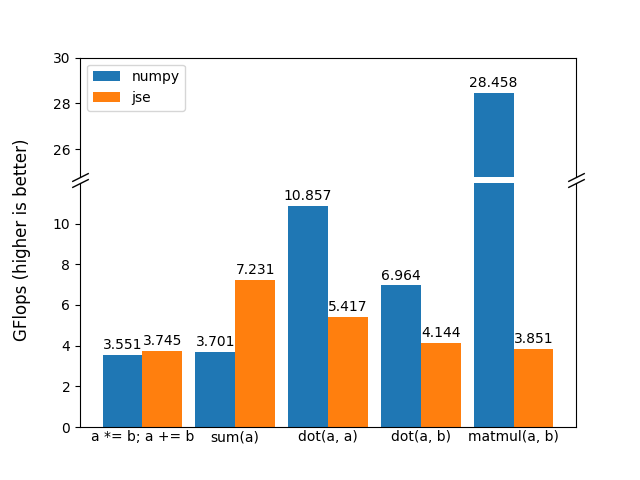

- [简单的数学库](math.md)
    - [基本使用方法](#基本使用方法)
    - [进阶运算](#进阶运算)
    - [其他功能](#其他功能)
    - [性能](#性能)
- [**⟶ 目录**](contents.md)

# 简单的数学库

jse 在 [`jse.code.UT.Math`](../src/main/java/jse/code/UT.java)
中提供了一套类似 numpy 简单数学库，用于方便的进行向量化运算。

对于各种向量和矩阵结构，jse 提供了：

- [`jse.math.vector.IVector`](../src/main/java/jse/math/vector/IVector.java)
存储浮点数 `double` 的向量类

- [`jse.math.matrix.IMatrix`](../src/main/java/jse/math/matrix/IMatrix.java)
存储浮点数 `double` 的矩阵类

- [`jse.math.vector.IComplexVector`](../src/main/java/jse/math/vector/IComplexVector.java)
存储复数 `ComplexDouble` 的向量类

- [`jse.math.matrix.IComplexMatrix`](../src/main/java/jse/math/matrix/IComplexMatrix.java)
存储复数 `ComplexDouble` 的矩阵类

- [`jse.math.vector.IIntVector`](../src/main/java/jse/math/vector/IIntVector.java)
存储整数 `int` 的向量类

- [`jse.math.matrix.IIntMatrix`](../src/main/java/jse/math/matrix/IIntMatrix.java)
存储整数 `int` 的矩阵类

- [`jse.math.vector.ILogicalVector`](../src/main/java/jse/math/vector/ILogicalVector.java)
存储逻辑值 `boolean` 的向量类

这里只重点介绍向量类 `IVector`，其余类结构和功能大同小异。


## 基本使用方法

- **创建和运算**
    
    一般的向量创建和运算可以直接使用 `jse.code.UT.Math`
    中的方法以及重载运算符实现，基本使用方法和 numpy 或 matlab 类似：
    
    ```groovy
    import static jse.code.UT.Math.*
    
    def x = linspace(-1.0, 1.0, 10) // #1.
    def y1 = sin(x * pi) // #2. #3.
    def y2 = x * x // #2.
    
    // x = [-1.000, -0.7778, -0.5556, -0.3333, -0.1111, 0.1111, 0.3333, 0.5556, 0.7778, 1.000]
    // y1 = [-1.225e-16, -0.6428, -0.9848, -0.8660, -0.3420, 0.3420, 0.8660, 0.9848, 0.6428, 5.666e-16]
    // y2 = [1.000, 0.6049, 0.3086, 0.1111, 0.01235, 0.01235, 0.1111, 0.3086, 0.6049, 1.000]
    ```
    
    > 脚本位置：`jse example/math/basic`
    > [⤤](../release/script/groovy/example/math/basic.groovy)
    > 
    > 1. 其中 `linspace` 方法会创建一个线性间隔点的向量 `IVector`
    > 
    > 2. 向量类 `IVector` 重载了常见的运算符，因此可以直接运算（统一为标量运算）
    > 
    > 3. `UT.Math` 还包含许多常用常量，如 `pi`, `e`, `nan`, `inf`
    >
    
- **索引**
    
    向量类 `IVector` 在 groovy 中可以像一般的 `List`
    一样访问和修改，但长度是固定的因此不能直接扩容：
    
    ```groovy
    import static jse.code.UT.Math.*
    
    def vec = zeros(5)
    def list = [0.0] * 5
    // vec = [0.000, 0.000, 0.000, 0.000, 0.000]
    // list = [0.000, 0.000, 0.000, 0.000, 0.000]
    
    vec[1] = 10.0 // #1.
    list[1] = 10.0 // #1.
    // vec = [0.000, 10.00, 0.000, 0.000, 0.000]
    // list = [0.000, 10.00, 0.000, 0.000, 0.000]
    
    vec[2..<5] = 20.0 // #2.
    list[2..<5] = 20.0 // #2.
    // vec = [0.000, 10.00, 20.00, 20.00, 20.00]
    // list = [0.000, 10.00, 20.00]
    
    vec += 3.0 // #3.
    list += 3.0 // #3.
    // vec = [3.000, 13.00, 23.00, 23.00, 23.00]
    // list = [0.000, 10.00, 20.00, 3.000]
    ```
    
    > 脚本位置：`jse example/math/getset`
    > [⤤](../release/script/groovy/example/math/getset.groovy)
    > 
    > 1. 当索引只有一个元素时，`IVector` 和 `List` 的行为一致，都是修改此位置的值
    > 
    > 2. 当索引为一个 `Range` 的时候，`IVector` 会直接修改整个区域的值，而 `List`
    > 会将整个区域设置为输入值
    > 
    > 3. 加法运算 `+` 对于 `IVector` 会直接进行数值运算，而 `List` 会像 python
    > 中那样将值添加到最后
    >
    > **注意**：和 python 或 c++ 不同，groovy 并没有提供专门的 `+=`
    > 运算符重载，因此这里的 `vec += 3.0` 会严格等价于 `vec = vec + 3.0`，
    > 也就是说，会先执行 `vec + 3.0`，创建一个新的临时向量存储结果，
    > 然后将结果赋值给 `vec`，对于 `list` 也是如此。
    > 这往往是非常低效的，因此如果希望向 `list` 中添加元素，需要使用
    > `list.add(3.0)` 或者 `list << 3.0`；
    > 如果希望将值数值计算增加到 `vec`，需要使用 `vec.plus2this(3.0)`。
    >
    
- **遍历**
    
    向量类 `IVector` 不支持直接使用增强 for 循环遍历，
    这里提供几种遍历的方法：
    
    ```groovy
    import static jse.code.UT.Math.*
    
    def vec = linsequence(0.0, 1.0, 3)
    
    // 索引遍历
    for (i in 0..<vec.size()) {
        println(vec[i])
    }
    // 转为 Iterable 遍历
    for (v in vec.iterable()) {
        println(v)
    }
    // 转为 List 遍历
    for (v in vec.asList()) {
        println(v)
    }
    // for-each 遍历
    vec.forEach {v ->
        println(v)
    }
    ```
    
    > 上述所有方法理论上效率几乎一致（特别是在增加 `@CompileStatic`
    > 注解后），并且都不会有冗余的值拷贝
    >


## 进阶运算

- **不创建中间变量的运算**
    
    和 python 或 c++ 不同，groovy 并没有提供专门的 `+=`
    运算符重载，因此如果使用：
    
    ```groovy
    vec += 3.0
    ```
    
    实际会执行：
    
    ```groovy
    vec = vec + 3.0
    ```
    
    也就是：
    
    ```groovy
    temp = vec + 3.0
    vec = temp
    ```
    
    其中会存在一步 *创建中间变量 `temp`*，
    这往往是非常耗时的。
    
    为了避免这个问题，jse 为这些运算提供了类似 `plus2this`
    的版本，会直接将运算结果赋值给自身。
    
    当然这样就不能使用 groovy 的运算符重载，
    具体可根据实际需要来权衡代码的简洁和性能。
    
    ```groovy
    import static jse.code.UT.Math.*
    
    rng(123456789)
    
    def x = rand(10)
    x.plus2this(2*pi) // x = u * 2π
    // x = [6.947, 6.740, 6.674, 7.177, 7.033, 6.643, 6.759, 6.770, 6.398, 6.532]
    
    def sinx = sin(x)
    def cosx = cos(x)
    // sinx = [0.6163, 0.4412, 0.3807, 0.7792, 0.6814, 0.3518, 0.4577, 0.4682, 0.1145, 0.2463]
    // cosx = [0.7875, 0.8974, 0.9247, 0.6268, 0.7319, 0.9361, 0.8891, 0.8836, 0.9934, 0.9692]
    
    // sin(x)^2 + cos(x)^2
    sinx.multiply2this(sinx)
    cosx.multiply2this(cosx)
    sinx.plus2this(cosx)
    // sinx = [1.000, 1.000, 1.000, 1.000, 1.000, 1.000, 1.000, 1.000, 1.000, 1.000]
    ```
    > 脚本位置：`jse example/math/opt2this`
    > [⤤](../release/script/groovy/example/math/opt2this.groovy)
    > 
    
- **通用运算**
    
    一些常用的运算会直接放在 `IVector` 类内部，
    而所有实现了的运算会存放在 `IVectorOperation`
    中，可以通过 `operation` / `opt` 方法获取到此
    `IVector` 对应的运算器。
    这样做可以防止 `IVector` 中充斥大量的不常用的运算方法，
    影响代码提示以及查看源码。
    
    ```groovy
    import static jse.code.UT.Math.*
    
    def a = linsequence(0.0, 1.0, 10)
    def b = linsequence(1.0, 1.0, 10)
    // a = [0.000, 1.000, 2.000, 3.000, 4.000, 5.000, 6.000, 7.000, 8.000, 9.000]
    // b = [1.000, 2.000, 3.000, 4.000, 5.000, 6.000, 7.000, 8.000, 9.000, 10.00]
    
    println(a.opt().dot()) // a · a = 285.0
    println(a.opt().dot(b)) // a · b = 330.0
    println(a.opt().cumsum()) // [0.000, 1.000, 3.000, 6.000, 10.00, 15.00, 21.00, 28.00, 36.00, 45.00]
    ```
    
    > 脚本位置：`jse example/math/optdot`
    > [⤤](../release/script/groovy/example/math/optdot.groovy)
    > 
    
    `IVectorOperation` 中也提供了一些通用的运算可以实现任意的操作：
    
    ```groovy
    import static jse.code.UT.Math.*
    
    def a = linsequence(0.0, 1.0, 10)
    def b = linsequence(1.0, 1.0, 10)
    // a = [0.000, 1.000, 2.000, 3.000, 4.000, 5.000, 6.000, 7.000, 8.000, 9.000]
    // b = [1.000, 2.000, 3.000, 4.000, 5.000, 6.000, 7.000, 8.000, 9.000, 10.00]
    
    a.opt().map2this {v -> v / 2.0} 
    // a.div2this(2.0)
    // a = [0.000, 0.500, 1.000, 1.500, 2.000, 2.500, 3.000, 3.500, 4.000, 4.500]

    a.opt().operate2this(b) {l, r -> l + r}
    // a.plus2this(b)
    // a = [1.000, 2.500, 4.000, 5.500, 7.000, 8.500, 10.00, 11.50, 13.00, 14.50]
    ```
    
    > 脚本位置：`jse example/math/optcom`
    > [⤤](../release/script/groovy/example/math/optcom.groovy)
    > 


## 其他功能

- **转换为其他类型**
    
    通过 `data()` 方法可以将 `IVector` 转为 `double[]`，
    此方法统一会创建一个新的 `size()` 长度的 `double[]`
    并将数据拷贝进去。
    `double[]` 类型对于跨语言编程会有更好的兼容性，
    例如在 matlab 中则会自动转换成 matlab 的向量数据，
    而在 jep 中可以作为 `jep.NDArray` 的内部数据输入（详见
    [NDArray 创建和使用](pythoningroovy.md#ndarray-创建和使用)）
    
    通过 `asList()` 方法可以将 `IVector` 转为 `List<Double>`，
    此方法统一**不会进行值拷贝**，因此得到的 `List<Double>`
    为关于此 `IVector` 的引用，两者的修改都会直接同步。
    `List<Double>` 类型可以使用 groovy 提供的关于
    `List` 的方法（当然依旧不能添加和删除元素）。
    
    通过 `asMatCol()` 和 `asMatRow()` 方法可以将 `IVector`
    分别转为单列矩阵或者单行矩阵 `IMatrix`，
    此方法统一**不会进行值拷贝**，因此得到的 `IMatrix`
    为关于此 `IVector` 的引用，两者的修改都会直接同步。
    
- **通过 `List` 直接创建**
    
    `jse.code.UT.Math` 中并没有提供通过 `List`
    来创建 `IVector` 的方法（类型 numpy 的 `array`），
    主要因为不能在编译器确定输出类型是 `IVector` 还是 `IMatrix`。
    
    因此需要先通过 `zeros` 来创建一个 `IVector`，
    然后再调用 `IVector` 的 `fill` 方法来将输入的 `List`
    填充进去：
    
    ```groovy
    import static jse.code.UT.Math.*
    
    def a = zeros(5)
    a.fill([1, 2, 3, 4, 5])
    ```
    
    不过 jse 在 `jse.math.vector.Vectors` 以及
    `jse.math.matrix.Matrices` 中提供了 `from`
    方法来直接通过输入的 `List` 分别创建 `IVector`
    和 `IMatrix`：
    
    ```groovy
    import jse.math.matrix.Matrices
    import jse.math.vector.Vectors

    def vec = Vectors.from([1, 2, 3, 4, 5])
    
    def mat = Matrices.from([
        [11, 12, 13, 14, 15],
        [21, 22, 23, 24, 25],
        [31, 32, 33, 34, 35],
        [41, 42, 43, 44, 45]
    ])
    ```
    
- **指定创建类型**
    
    jse 中，对于浮点数矩阵 `IMatrix`，
    存在两种实现，按列排列的矩阵 `ColumnMatrix` 和
    按行排列的矩阵 `RowMatrix`，
    在一般情况下两者使用起来不会有任何区别。
    
    在默认情况下，直接通过 `jse.code.UT.Math.zeros`
    之类的方法创建的矩阵实际都是 `ColumnMatrix`，如果希望创建一个
    `RowMatrix`，可以直接通过 `RowMatrix` 类中的 `zeros`
    方法来创建：
    
    ```groovy
    import jse.math.matrix.RowMatrix
    
    def mat = RowMatrix.zeros(4, 5)
    ```
    
    其余类型也是相同的逻辑，例如直接创建一个整数向量 `IntVector`：
    
    ```groovy
    import jse.math.vector.IntVector
    
    def vec = IntVector.zeros(10)
    ```
    
- **不定长度向量创建**
    
    直接创建的 `IVector` 不能修改长度，因此创建时需要提前知道长度，
    这并不总是可行。
    jse 提供了 `Vector.builder()` 方法来获取一个关于 `Vector`
    的构造器，并可以像 `List` 一样不断添加元素，而在构造完成后可通过
    `build()` 方法完成向量的创建：
    
    ```groovy
    import jse.math.vector.Vector
    
    def build = Vector.builder()
    for (i in 0..<10) {
        build.add(i)
    }
    def vec = build.build()
    // vec.size() == 10
    ```
    
- **直接获取内部数据**
    
    向量类 `IVector` 的一般实现 `Vector`
    内部使用 `double[]` 来存储数据，
    对此可能希望直接获取内部的 `double[]` 数据，
    从而可以避免使用 `data()` 方法时的一次值拷贝。
    这里可以通过 `internalData()` 方法直接获取到内部的
    `double[]` 数据：
    
    ```groovy
    import jse.math.vector.Vector
    
    def vec = Vector.zeros(10)
    def data = vec.internalData()
    ```
    
    > **注意**：
    >
    > 1. 一般情况下，有 `data.size() >= vec.size()`。
    >
    > 2. `ColumnMatrix` 和 `RowMatrix` 内部数据也是 `double[]`，
    > 其中 `ColumnMatrix` 会按照列来排列数据，而 `RowMatrix`
    > 会按照行来排列数据。
    > 因此在和 `jep.NDArray` 相互转换时 `RowMatrix` 会比较常用。
    >
    
    同理也可以直接通过 `double[]` 来创建 `Vector`：
    
    ```groovy
    import jse.math.vector.Vector
    
    double[] data = [1, 2, 3, 4, 5]
    def vec = new Vector(data)
    ```
    
    这样会直接将输入的 `data` 作为内部使用的数据，而不会做任何值拷贝。


## 性能

java 会在运行时自动进行 SIMD 优化，
因此一般的标量运算性能和 numpy 之类的库基本一致，
而矩阵乘法之类的运算会慢 2~10 倍。

这里展示简单的测试结果，注意这里手动关闭了
numpy 使用的线性代数库的并行保证测试公平
（开启并行后 `dot` 速度会异常的慢，而 `matmul`
速度可以达到 `80 GFlops`）。



> - 测试平台：Windows 10
> - CPU：AMD Ryzen 9 5900X
> - python: 3.10.11
> - numpy: 1.26.0
> - 额外环境变量: OPENBLAS_NUM_THREADS=1
> - jse: 2.8.0
> - java: 17.0.8, Oracle

